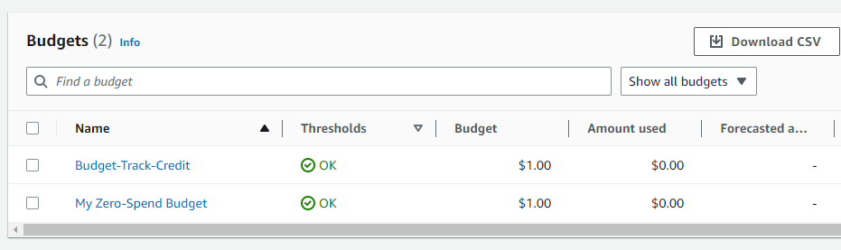

# Week 0 — Billing and Architecture

## Required Homework

### Installing AWS CLI

Firstly, I installed AWS CLI manually on Gitpod. Then I updated the gitpod.yml file to automate the installation so that I don’t need to run those commands every time.


```yml
tasks:
  - name: aws-cli
    env:
       AWS_CLI_AUTO_PROMPT: on-partial
    init: |
       cd /workspace
       curl -fSsl "https://awscli.amazonaws.com/awscli-exe-linux-x86_64.zip" -o "awscliv2.zip"
       unzip -qq awscliv2.zip
       sudo ./aws/install --update
       cd $THEIA_WORKSPACE_ROOT
```

After that AWS CLI is installed automaticlly without issues.


### Creating a Budget

I created two Budgets one for zero spend Budget the other one is for tracking Credit spend. 



The Budget-Track-Credit Budget is created using AWS CLI as follows. The [budget.json](https://github.com/Dsar-gh/aws-bootcamp-cruddur-2023/blob/main/aws/json/budget.json) and [notifications-with-subscribers.json](https://github.com/Dsar-gh/aws-bootcamp-cruddur-2023/blob/main/aws/json/notifications-with-subscribers.json) files are in The Repo.

```aws
aws budgets create-budget \
     --account-id $ACCOUNT_ID \
     --budget file://aws/json/budget.json \
     --notifications-with-subscribers file://aws/json/notifications-with-subscribers.json
```

### Creating a Billing Alarm

To create a Billing Alarm (CloudWatch Alarm) I needed to create an Amazon SNS Topic using the following AWS CLI commands.

```aws
create sns topic
aws sns create-topic --name billing-alarm
aws sns subscribe --topic-arn arn:aws:sns:us-east-1:745238295000:biling-alarm --protocol email --notification-endpoint ******@****.com	 
```

After that I was able to create a CloudWatch Alarm using AWS CLI as well. The [alarm-config.json](https://github.com/Dsar-gh/aws-bootcamp-cruddur-2023/blob/main/aws/json/alarm-config.json) is added to the Repo.

```aws
aws cloudwatch put-metric-alarm --cli-input-json file://aws/json/alarm-config.json
```


### Recreating Cruddur Logical and Conceptual Diagrams

This homework was challenging. Since I am a beginner I couldn't really change the original diagram but tried to understand it and get to use Lucid Charts.

Here is the [Conceptual Diagram.](https://lucid.app/lucidchart/14da898a-834b-4c59-ad04-81038a67a108/edit?viewport_loc=-153%2C-112%2C2287%2C1108%2C0_0&invitationId=inv_641d93e2-018b-4440-9d04-cf5ef1d45ef2)


And this is the [Logical Diagram.](https://lucid.app/lucidchart/f7e60776-576d-4573-b755-6dd672766381/edit?viewport_loc=-50%2C-11%2C2502%2C1212%2C0_0&invitationId=inv_cdff1b6a-352b-44c0-85ab-ed46df57f89c)


## Homework Challenges

### Authenicate Root User using MFA
I was able to set MFA for my root user and IAM user.


